<!-- markdownlint-disable MD033 -->
<!-- Theme: Cobalt Forge — steel / navy blues, electric cyan, amber accents -->
 

<!-- Profile README cannot run JS/canvas; header is self-hosted animated SVG (SMIL). -->

  <h2>Hi, I'm Clayon 👋</h2>
  
Full-stack engineer focused on Web3, distributed systems, and production-grade DevOps.

   
  

    
  

    
  
<strong>Tech stack</strong>

  

    
    &nbsp;&nbsp;
    
    &nbsp;&nbsp;
    
  

   
  

    
    &nbsp;&nbsp;
    
  

## About Me

- Former developer of Huobi Heco chain.
- End-to-end engineer: Frontend, Backend, DevOps, and Smart Contract.
- Built dApps and infrastructure for public-chain ecosystems.
- Stack: Vue3/React (Nuxt/Next), TypeScript, Go, Rust, NestJS (Prisma), Solana, Move (Sui).

## GitHub Analytics

  
  

  
  

  <!-- github-profile-trophy.vercel.app often 503 DEPLOYMENT_PAUSED; mirror is API-compatible -->
  

## Contribution Snake

  <picture>
    <source media="(prefers-color-scheme: dark)" srcset="https://raw.githubusercontent.com/BTCB/BTCB/output/github-snake-dark.svg" />
    <source media="(prefers-color-scheme: light)" srcset="https://raw.githubusercontent.com/BTCB/BTCB/output/github-snake.svg" />
    
  </picture>

  

